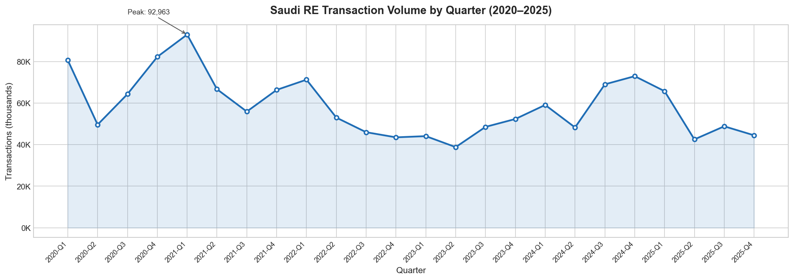
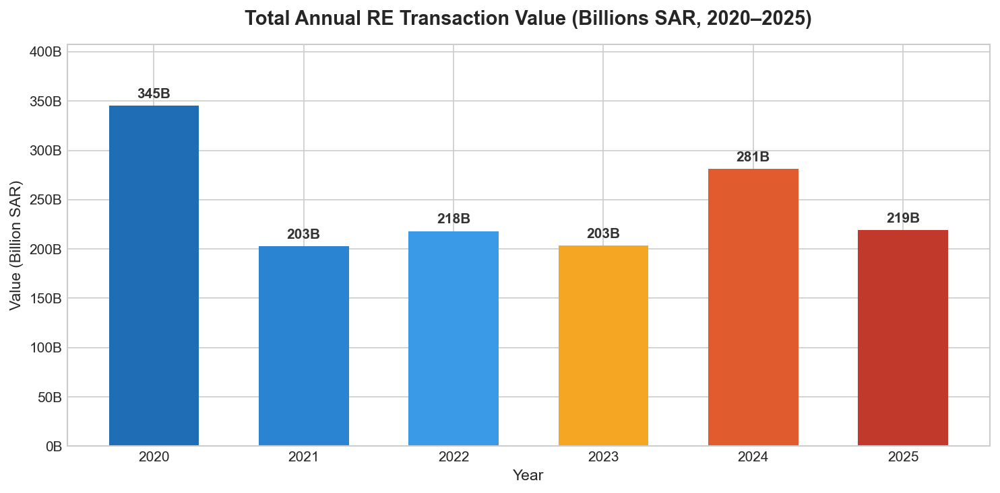
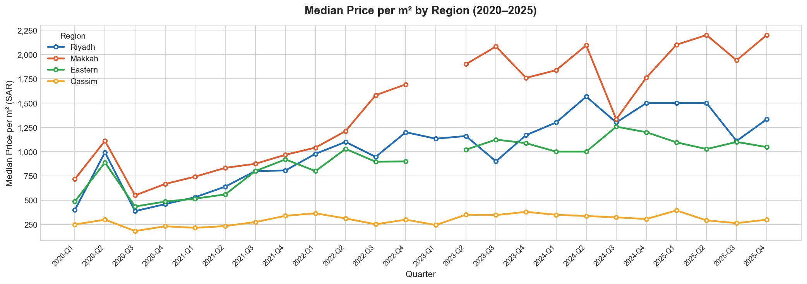
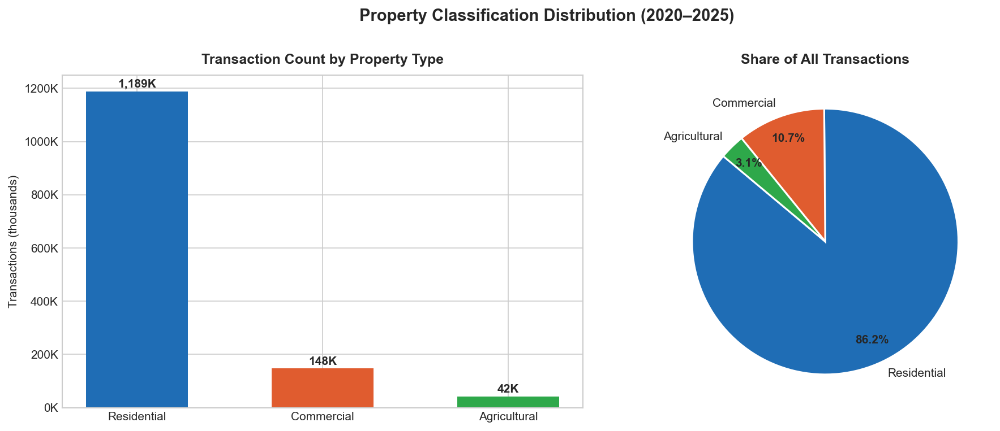
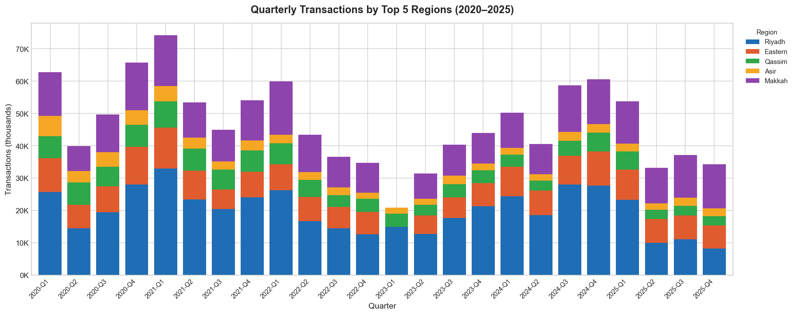
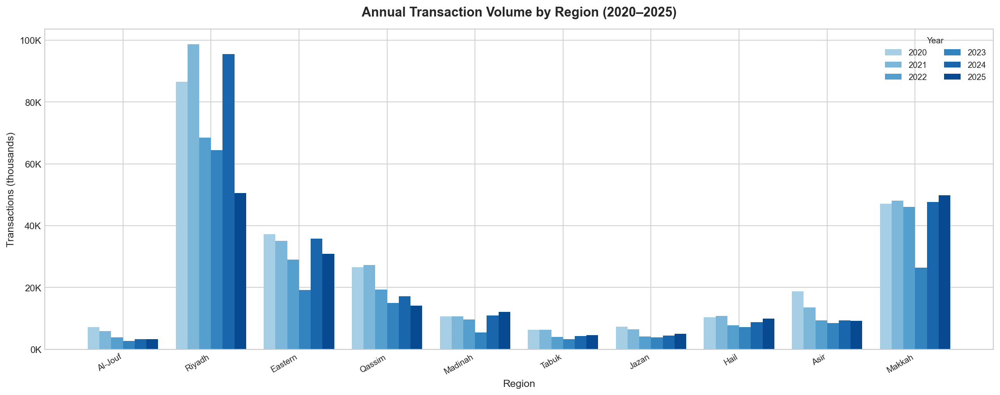

# Saudi Real Estate Open Data (بيانات العقار المفتوحة)

<p align="center">
  <a href="https://rega.gov.sa">REGA - Real Estate General Authority (الهيئة العامة للعقار)</a>
  &nbsp;&nbsp;&nbsp;&nbsp;
  <a href="https://moj.gov.sa">MOJ - Ministry of Justice (وزارة العدل)</a>
</p>

[](LICENSE)
[](LICENSE-DATA.md)
[](CHANGELOG.md)

🌐 [النسخة العربية](README-AR.md)

Consolidated open data from Saudi Arabia's **Ministry of Justice (MOJ; وزارة العدل)** and **Real Estate General Authority (REGA; الهيئة العامة للعقار)**, covering **7.4 million** real estate transaction records across **288 CSV files** from 2018 to 2026.

Saudi real estate data is scattered across multiple government portals, published in inconsistent formats with Arabic-only headers and undocumented schema changes. This project consolidates it into one place with clean documentation, a self-describing metadata registry, quality audits, and initial analysis — making it usable for researchers, analysts, investors, and developers.

This is an experiment in progress. I'm exploring what use cases, correlations, and insights this data can support. If you find it useful or have ideas, I'd like to hear about it.

**Keywords:** Saudi Arabia real estate data, Saudi property market, MOJ transactions, REGA indicators, Saudi housing data, Riyadh property prices, Saudi rental data, Ejar, open data Saudi Arabia, بيانات عقارية سعودية, سوق العقار السعودي

---

## Table of Contents

- [Data Summary](#data-summary)
- [Quick Context — How Saudi RE Data Works](#quick-context--how-saudi-re-data-works)
- [Sample Charts](#sample-charts)
- [Repository Structure](#repository-structure)
- [Documentation Guide](#documentation-guide)
- [Known Limitations](#known-limitations)
- [Analysis Ideas](#analysis-ideas)
- [Data Access Patterns](#data-access-patterns)
- [Data Sources & Update Cadence](#data-sources--update-cadence)
- [Legal Status](#legal-status)
- [Related Resources](#related-resources)
- [Contributing](#contributing)

---

## Data Summary

| Source | Category | Files | Rows | Period | Description |
|--------|----------|-------|------|--------|-------------|
| **MOJ** | Sales transactions | 24 | 1,407,000 | 2020–2025 | Individual sale records: price, area, location, classification, reference number |
| **MOJ** | RE operations (36 types) | 215 | 5,959,000 | 2023–2026 | Mortgages, seizures, transfers, POAs, enforcement, grants, compensation, deed updates, mergers, divisions, monthly aggregates |
| **MOJ** | Market indices | 3 | 3,000 | 2018–2021 | Historical price indices by region, city, district |
| **REGA** | Sales indicators | 31 | 21,000 | 2024–2025 | Aggregate sales by region: avg/min/max price per m², deed counts |
| **REGA** | Rental indicators | 13 | 20,000 | 2019–2024 | Rental market by city for all 13 administrative regions |
| **REGA** | Other | 2 | 32,700 | 2024–2025 | Gender registration stats, consolidated quarterly report |
| **REGA** | Charts | 8 | — | 2024–2025 | Infographic visualizations |
| | **Total** | **288 CSVs** | **~7,440,000** | **2018–2026** | **853 MB** |

### Key Numbers

- **1.41 million** sale transactions across all 13 Saudi regions, 175 cities, 13,398 neighborhoods
- **1,426.8 Billion SAR** (~$380B USD) total transaction value over 2020–2025
- **85% residential**, 10.6% commercial, 4% agricultural, <0.1% industrial
- **Riyadh** dominates: 34% of all transactions, 49% of total value
- **Top 5 cities:** Riyadh (330K deals), Jeddah (164K), Buraydah (62K), Makkah (53K), Madinah (52K)
- **36 transaction categories** beyond sales: mortgages, seizures, property divisions, POAs, enforcement (3 sub-types), grants, compensation, ownership rates, monthly aggregates, and more

---

## Quick Context — How Saudi RE Data Works

Saudi Arabia has two main entities publishing real estate data:

**MOJ** registers all property transactions through notary offices (كتابات العدل). Every sale, mortgage, seizure, transfer, and deed change goes through MOJ. This is **transaction-level data** — individual records with exact prices, areas, dates, and reference numbers. It's the richest source.

**REGA** regulates the market and publishes **aggregate indicators** — average prices per m², transaction counts, and rental metrics by region and quarter. Less granular than MOJ, but includes rental data and property-type breakdowns that MOJ doesn't have.

**Ministry of Municipal, Rural Affairs and Housing (MOMAH; وزارة الشؤون البلدية والقروية والإسكان)** administers zoning, the White Land Tax (رسوم الأراضي البيضاء), and housing policy. Not a data source in this repo, but relevant context for regulatory overlay analysis.

All data is published through the [Saudi National Open Data Portal](https://open.data.gov.sa), governed by the KSA Open Data License. See the [Glossary](GLOSSARY.md) for definitions of all Arabic terms.

### MOJ vs REGA — What Each Provides

| Aspect | MOJ | REGA |
|--------|-----|------|
| **Data level** | Individual transactions | Aggregate indicators |
| **Has exact price per deal** | Yes | No (avg/min/max per m²) |
| **Has exact area per deal** | Yes | No (totals per group) |
| **Has reference numbers** | Yes | No |
| **Has rental data** | No | Yes (all 13 regions) |
| **Has property type (land/villa/apartment)** | Only 2023 Q1-Q3 | Yes (in indicator files) |
| **Date range** | 2020–2025 (sales), 2024–2025 (ops) | 2024–2025 (sales), 2019–2024 (rental) |
| **Regional coverage** | All 13 regions | 6 regions (sales), 13 (rental) |

---

## Sample Charts

Generated from the [analysis notebooks](notebooks/) using the MOJ sales data:

### Transaction Volume (2020–2025)

*Quarterly transaction count showing the 2023 dip and 2024 recovery*

### Annual Deal Value

*Total transaction value in Billions SAR by year*

### Price per m² Trends by Region

*Median price per square meter for top 4 regions over time*

### Property Classification

*Distribution of transactions by property classification (residential/commercial/agricultural)*

### Regional Breakdown

*Quarterly transactions by top 5 regions*

### Region × Year Heatmap

*Annual transaction volume for top 10 regions*

See [notebooks/](notebooks/) for the full code and analysis.

---

## Repository Structure

```
├── moj/                              # Ministry of Justice data
│   ├── sales/                        # 24 quarterly sales + 3 historical index files (2018–2025)
│   ├── real-estate/                  # 190 files across 36 operation categories (2024–2025)
│   └── monthly/                      # 52 monthly aggregate files (operations + POAs, 2023–2026)
├── rega/                             # Real Estate General Authority data
│   ├── Sales-transaction-*           # Regional quarterly sales indicators
│   ├── Rental-indicators-*           # Regional rental indicators (all 13 regions)
│   ├── charts/                       # 8 infographic visualizations
│   ├── complementary/                # Supplementary rental data
│   ├── Open-Data-Toolkit-EN.pdf      # REGA open data methodology guide
│   ├── User-Manual-AR.pdf            # REGA portal user manual (Arabic)
│   └── User-Manual-EN.pdf            # REGA portal user manual (English)
├── data/
│   ├── region_mapping.csv            # 33 region spelling variants → 13 canonical names
│   ├── schema.json                   # Compact schema per category (for AI tools)
│   ├── registry.json                 # Full metadata catalog as JSON
│   ├── registry_files.csv            # Metadata for all 292 CSVs (from registry)
│   ├── registry_fields.csv           # Field catalog: types, nulls, min/max, samples
│   └── registry_enums.csv            # Enum values for categorical fields
├── docs/                             # Research, audits, and deep-dives (see below)
├── scripts/
│   ├── build_registry.py             # Metadata registry builder (42 categories)
│   └── download_new_data.py          # Automated downloader for new MOJ/REGA datasets
├── monitor/
│   └── re_data_monitor.py            # Automated new-data detection
├── notebooks/                        # Sample analyses with charts
│   ├── 01-transaction-trends.ipynb   # Volume, regional, annual value charts
│   └── 02-market-indicators.ipynb    # Price/m², classification, heatmap
├── GLOSSARY.md                       # Arabic RE terms → English definitions
├── CHANGELOG.md                      # Data update history
├── LICENSE                           # MIT (scripts & tools)
├── LICENSE-DATA.md                   # KSA Open Data License & attribution
└── DISCLAIMER.md                     # Not official, not investment advice
```

> **Clone size:** ~850 MB (data-heavy repo). For faster clone: `git clone --depth 1 https://github.com/civillizard/Saudi-Real-Estate-Data.git`

---

## Documentation Guide

This repo includes extensive research and audit documentation. Here's what each file covers and why it matters:

### Core Reference

| Document | Summary | Why it matters |
|----------|---------|---------------|
| [**GLOSSARY.md**](GLOSSARY.md) | 50+ Arabic real estate terms with English translations, grouped by category: entities, property types, transaction types, classifications, regulatory terms | Start here if you're new to Saudi RE terminology |
| [**docs/DATA_DICTIONARY.md**](docs/DATA_DICTIONARY.md) | Complete field catalog: 41 canonical fields mapped from Arabic, all 26 categories with schemas, enum values with translations, formatting notes | The definitive reference for understanding what each column means across all files |
| [**docs/MOJ-DATA.md**](docs/MOJ-DATA.md) | Complete MOJ data documentation: API endpoints for downloading, schema for all 18+ operation categories, transactions broken down by region/year/city, data quality notes | The definitive reference for working with MOJ data |
| [**data/region_mapping.csv**](data/region_mapping.csv) | Maps all 33 known Arabic spelling variants to 13 canonical region names (Arabic + English) | Essential for any cross-file aggregation — apply before grouping |

### Data Quality Audits

| Document | Question it answers | Key finding |
|----------|-------------------|-------------|
| [**docs/SURVEY_REPORT.md**](docs/SURVEY_REPORT.md) (4,127 lines) | What's in each of the 159 CSV files? | File-by-file scan: encoding, row/column counts, header analysis, type inference, formatting quirks for every CSV |
| [**docs/AUDIT_REPORT.txt**](docs/AUDIT_REPORT.txt) | Is the REGA data complete? | Rental: 100% (all 13 regions). Sales: only 6/13 regions have indicator data. 70 quarter-region combos still missing |
| [**docs/ASSET_TYPE_AUDIT.md**](docs/ASSET_TYPE_AUDIT.md) | Can we tell land from buildings? | Only via `نوع العقار` in 2023 Q1-Q3 sales + REGA indicators. The `تصنيف العقار` column only gives sector (residential/commercial), not property type |
| [**docs/REFERENCE_NUMBER_AUDIT.md**](docs/REFERENCE_NUMBER_AUDIT.md) | Can reference numbers link assets across categories? | No. Zero cross-category overlap across 1.55M records. Two separate numbering pools (27M–32M for notary, 14M–17M for enforcement). Dead end for lifecycle tracking |
| [**docs/PROPERTY_IDENTITY_AUDIT.md**](docs/PROPERTY_IDENTITY_AUDIT.md) | Do Property Identity files bridge transactions? | No. They're digital service registration logs with constant region/city values — not a property registry |

### Research & Ideas

| Document | What it contains |
|----------|-----------------|
| [**docs/ANALYSIS_IDEAS.md**](docs/ANALYSIS_IDEAS.md) | 44 analysis ideas scored by feasibility, uniqueness, and commercial potential. Covers market dynamics, regulatory impact, rental-vs-sale, distressed assets, and more |
| [**docs/API_RESEARCH.md**](docs/API_RESEARCH.md) | 13 Saudi RE-related APIs rated HIGH/MEDIUM/LOW: Wathq Deeds (property-level lookup), National Address (geocoding), KAPSARC (price indices), SAMA (mortgage stats), Etimad (procurement tenders) |
| [**docs/WHITE_LAND_TAX_RESEARCH.md**](docs/WHITE_LAND_TAX_RESEARCH.md) | Full regulatory timeline of the White Land Tax: 2015 law, 2025 overhaul (0–10% tiered zones), Riyadh Tier 1 neighborhoods, vacant building fees (coming May 2026) |

### Tools

| Tool | Purpose |
|------|---------|
| [**scripts/build_registry.py**](scripts/build_registry.py) | Scans all CSVs and builds `registry.db` — a SQLite catalog with schema, field types, enum values, and sample rows for every file. Maps Arabic headers to 41 canonical English field names. Exported as CSV in [`data/registry_*.csv`](docs/DATA_DICTIONARY.md#csv-exports) |
| [**monitor/re_data_monitor.py**](monitor/re_data_monitor.py) | Daily automated check of the Open Data Portal + REGA + White Land Tax portal for new datasets. Sends email alerts when new data appears |

---

## Known Limitations

We've audited the data thoroughly and documented what it **can't** do — so you don't have to discover the same dead ends:

1. **No property lifecycle tracking.** Reference numbers are per-transaction, not per-property. You can't follow a property from purchase → mortgage → seizure → sale. ([Details](docs/REFERENCE_NUMBER_AUDIT.md))

2. **No land vs. building distinction** except in 2023 Q1–Q3 and REGA aggregates. The standard `تصنيف العقار` (property classification) column only tells you residential/commercial/agricultural — not whether it's a plot of land or a built villa. ([Details](docs/ASSET_TYPE_AUDIT.md))

3. **Property Identity files are service logs**, not a property registry bridge. Despite the promising name, they contain constant region/city values and no deed or parcel numbers. ([Details](docs/PROPERTY_IDENTITY_AUDIT.md))

4. **33 region name variants** — the same region appears with different Arabic spellings across files. Use [`data/region_mapping.csv`](data/region_mapping.csv) to normalize before aggregation.

5. **Date format inconsistency** — most files use `YYYY/MM/DD`, some 2024 monthly files use `M/D/YYYY`. Dual Gregorian + Hijri dating in most files.

6. **Comma-formatted numbers** — price and area fields use comma thousands separators (`1,800,000`). Remove commas before numeric operations.

7. **REGA sales coverage gaps** — only 6 of 13 regions have REGA sales indicator data. 7 regions (Asir, Qassim, Al Jouf, Northern Borders, Najran, Tabuk, Jazan) have zero REGA sales files. MOJ data covers all 13 regions.

8. **2023 data anomaly** — transaction volume dropped to 140K from 282K in 2021. Also, 2023 Q1 has a different schema (13 columns vs standard 10, includes `نوع العقار`). Reason for the dip is unclear — could be a real market slowdown or a data collection change.

9. **MOJ Transfers Q2/Q3 row count anomaly** — `MOJ-Transfers-2025-Q1.csv` has 219,591 rows, while Q2 and Q3 have ~800 rows each (a 270x drop). The Q2/Q3 files likely represent truncated or differently-scoped portal exports. Verify against the source portal before using transfer data for trend analysis.

10. **Enforcement Sale schema change** — Q1 has 6 columns (includes Hijri date `تاريخ القرارهجري`), while Q2–Q4 have 5 columns (Hijri date dropped). Account for this when merging across quarters.

---

## Analysis Ideas

We've brainstormed [44 analysis ideas](docs/ANALYSIS_IDEAS.md). Highlights with the highest potential:

| Idea | Feasibility | Uniqueness | Commercial Value |
|------|-------------|------------|-----------------|
| **Price per m² by district** (2020→2025) | Medium | High — nobody publishes district-level trends | High — developers, investors, banks |
| **Emerging cities** — low base, high growth | High | High — no public ranking exists | High — early-mover advantage |
| **Regulatory impact** — White Land Tax vs. transaction volumes | Medium | High — district-level overlay | High — policy analysis |
| **Seizure pipeline** — aggregate seizure → release → enforcement trends | High | High | Medium — distressed asset investors |
| **Rental yield estimation** — REGA rents ÷ MOJ sale prices | Medium | High | High — yield-seeking investors |
| **Seasonal patterns** — quarter-over-quarter with Ramadan/Hajj adjustment | High | Medium | Medium — timing guidance |
| **Deal size trends** — are lots shrinking? Units smaller? | High | High | Medium — market structure |

Full list with data requirements, challenges, and workarounds: [docs/ANALYSIS_IDEAS.md](docs/ANALYSIS_IDEAS.md)

---

## Data Access Patterns

### Direct CSV Access

```python
import pandas as pd
from pathlib import Path

# Load all MOJ sales
frames = []
for f in sorted(Path("moj/sales").glob("MOJ-Sales-*.csv")):
    df = pd.read_csv(f)
    frames.append(df)
sales = pd.concat(frames, ignore_index=True)

# Clean price column (remove comma thousands separators)
sales['السعر'] = sales['السعر'].astype(str).str.replace(',', '').astype(float)
sales['المساحة'] = sales['المساحة'].astype(str).str.replace(',', '').astype(float)
```

### Region Normalization

Apply the mapping before any cross-file aggregation:

```python
mapping = pd.read_csv("data/region_mapping.csv")
variant_to_canonical = dict(zip(mapping['variant'], mapping['canonical_en']))
sales['region_en'] = sales['المنطقة'].map(variant_to_canonical)
```

### Registry Queries

The metadata registry catalogs every CSV's schema, field types, enum values, and sample rows. CSV exports are available in `data/registry_*.csv` for use without SQLite — see the [Data Dictionary](docs/DATA_DICTIONARY.md) for field definitions and enum translations.

```bash
# Rebuild the registry after adding new data
python3 scripts/build_registry.py

# What files have price data?
sqlite3 registry.db "SELECT f.filename, fi.canonical_name
  FROM files f JOIN fields fi ON f.id = fi.file_id
  WHERE fi.canonical_name = 'price';"

# What property classifications exist?
sqlite3 registry.db "SELECT ev.value, sum(ev.count)
  FROM enum_values ev JOIN fields f ON ev.field_id = f.id
  WHERE f.canonical_name = 'property_classification'
  GROUP BY ev.value ORDER BY sum(ev.count) DESC;"

# List all canonical field names
sqlite3 registry.db "SELECT DISTINCT canonical_name FROM fields
  WHERE canonical_name IS NOT NULL ORDER BY canonical_name;"
```

---

## Data Sources & Update Cadence

| Source | Portal | Frequency | Detection |
|--------|--------|-----------|-----------|
| MOJ Sales & Operations | [open.data.gov.sa](https://open.data.gov.sa) | Quarterly (~2–4 weeks after quarter end) | Automated daily monitor |
| REGA Sales Indicators | [open.data.gov.sa](https://open.data.gov.sa) | Quarterly, per region | Automated daily monitor |
| REGA Rental Indicators | [rentalrei.rega.gov.sa](https://rentalrei.rega.gov.sa) | Irregular (typically annual) | Automated daily monitor |

The `monitor/` directory contains an automated scanner that checks the Open Data Portal and REGA daily, tracking dataset counts and page content hashes, and sending email alerts when new files appear.

All data was obtained from public, unauthenticated government APIs and portal downloads. No API keys, credentials, or special access were required. The download URL pattern is predictable (`/odp-public/{ORG_ID}/{DATASET_ID}/v{N}/{RESOURCE_NAME}.csv`), so when the resources API returned empty responses for some datasets, we reconstructed the URLs from working sibling datasets in the same category. This recovered 4 of 5 broken files — the technique and results are documented in [docs/MOJ-DATA.md](docs/MOJ-DATA.md#recovery-of-missing-files).

Updates to this repository are tagged by date (e.g., `v2026-03-24`). See [CHANGELOG.md](CHANGELOG.md) for the full history.

---

## Legal Status

The CSV data files are **unmodified government open data** published under the [KSA Open Data License](https://open.data.gov.sa/en/pages/policies/license).

**Summary:**
- **Redistribution:** Allowed with attribution
- **Derivative works:** Allowed — *"freedom in distributing, producing, and transforming works regarding datasets, as well as building upon them"*
- **Commercial use:** Not explicitly prohibited (no NC clause)
- **Attribution:** Required — cite MOJ / REGA as the data source
- **Modification caveat:** MOJ requires their raw data to be *"preserved without modification."* Raw CSVs in this repo are unmodified. Analyses and derived works are clearly labeled as ours, not government data.

See [LICENSE-DATA.md](LICENSE-DATA.md) for full details including exact policy quotes, attribution requirements, and the raw-vs-derived distinction.

Scripts and tools: [MIT License](LICENSE). Not investment advice: [DISCLAIMER.md](DISCLAIMER.md).

---

## Related Resources

### Government Portals
- [Saudi National Open Data Portal](https://open.data.gov.sa) — primary data source for MOJ and REGA
- [REGA Rental Indicators Portal](https://rentalrei.rega.gov.sa) — rental market API (Ejar data)
- [MOJ Open Data](https://www.moj.gov.sa/ar/opendata/Pages/reports.aspx) — MOJ data catalog
- [White Land Tax Portal](https://idlelands.momah.gov.sa) — vacant land zone maps and regulations
- [Saudi National Data Bank](https://data.gov.sa) — CKAN-based portal with 11K+ government datasets

### APIs for Enrichment
- [Wathq Developer Portal](https://developer.wathq.sa) — paid API for deed-level property lookups
- [National Address API](https://api.address.gov.sa) — free geocoding for Saudi addresses
- [KAPSARC Data Portal](https://data.kapsarc.org) — real estate price index timeseries (free)
- [SAMA Open Data](https://www.sama.gov.sa/en-us/EconomicReports/) — central bank mortgage and lending statistics

Full API research with 13 sources rated by relevance: [docs/API_RESEARCH.md](docs/API_RESEARCH.md)

---

## For AI Agents & Automated Tools

This repository is structured for automated consumption:

- **`data/region_mapping.csv`** — machine-readable region normalization table
- **`data/schema.json`** — compact schema for each category: fields, types, enums, date formats (80 KB, ideal for AI tools)
- **`data/registry.json`** — full metadata catalog as JSON: every file, every field, sample values (478 KB)
- **`data/registry_files.csv`**, **`data/registry_fields.csv`**, **`data/registry_enums.csv`** — same metadata as CSV ([documentation](docs/DATA_DICTIONARY.md#csv-exports))
- **`registry.db`** — same metadata as SQLite (rebuild with `python3 scripts/build_registry.py`)
- **`rega/datasets.json`** — REGA dataset catalog in JSON format
- **`GLOSSARY.md`** — structured Arabic↔English term mapping
- **All CSVs** use UTF-8 encoding (most with BOM), comma delimiters, CRLF line endings

### Structured Data Summary (for LLM context)

```
Dataset: Saudi Real Estate Open Data
Coverage: 2018-2025, 13 administrative regions, 175 cities
Sources: MOJ, REGA
Records: 5,100,000 across 159 CSV files
Categories: Sales (1.41M), Mortgages (36K), Seizures (737K), Transfers (221K),
  POAs (758K), Enforcement Sales (8.3K), Property Divisions (90K), and 11 more
Formats: CSV (UTF-8-BOM, comma-delimited), SQLite registry, JSON catalog
Language: Arabic headers with English canonical mappings in registry
License: KSA Open Data License (redistribution + derivatives allowed with attribution)
Update frequency: Quarterly (MOJ/REGA sales), monthly (MOJ operations)
Known gaps: No property-level IDs, land/building type only in 2023 Q1-Q3,
  33 region spelling variants (mapping file provided)
```

---

## Contributing

If you spot data quality issues, have analysis ideas, or want to contribute notebooks — issues and pull requests are welcome.

Possible contributions:
- Additional analysis notebooks (rental trends, mortgage patterns, regional deep-dives)
- Data cleaning scripts (region normalization, date parsing, price formatting)
- Visualizations and dashboards
- Translations of documentation to Arabic
- Integration with external APIs (KAPSARC price indices, National Address geocoding)

## Author & Contact

**Mamdoh AlOqiel** — Riyadh, Saudi Arabia

- **Email:** [mao@6ra3.com](mailto:mao@6ra3.com)
- **Issues & feedback:** [GitHub Issues](https://github.com/civillizard/Saudi-Real-Estate-Data/issues)
- **Contributions:** Pull requests welcome — open an issue first to discuss bigger changes

Open to collaboration on Saudi real estate data analysis, government open data projects, and market research.
